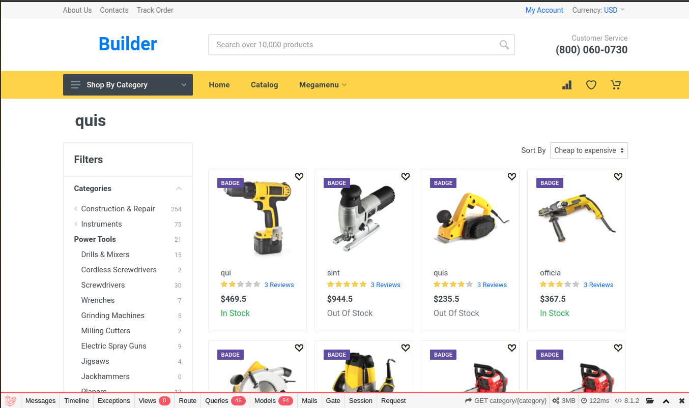

# Laravel + Vue Website

## About this website

This this a e-commerce website I am building when learning laravel/php - so the site is based on laravel and it is still in development. It has a lot of capabilities that typical e-commerce website has:

- shopping cart management with total and subtotal calculation.
- Product belongs to Category and has its own Characteristics. Also Product has Reviews and Questions, that have Replies and could be Voted.
- Category can have subcategories.
- If you consider Question or Review offensive you can Report it.
- Product Set consists of 2 products and could be bought. List of Product Sets that current Product belongs to is shown on the Product description page.
- Percent Discounts or Discounts With Fixed Price, that may have expiration date and could be activated with a coupon code - to do that discounts were implemented as a separate classes in app\Discounts. Coupon code is applied in shopping cart.
- Videos and Photos could be attached to the Product. Photos are shown in the slider on a product description page.
- Products could be added to the Wishlist. You can have several named wishlists which can be renamed, deleted or set as default. Wishlist calculates the total and adds selected products to the Cart. Selected products could be deleted from wishlist or moved to another wishlist. You can expose the wishlist to the public - it will have a public URL. When you add Products to Wishlist - in fact you add them to default Wishlist.

Default user login credentials: Email - "test@gmail.com"; Password - "password".

There is admin panel (located in /admin-panel), where all products, products sets, ... are managed.
Also I have DB Schema (written with Mysql Workbench) * it is located in file "shop db schema.mwb".

## Technology stack

- Laravel
- Vue
- MySQL
- PhpUnit
- PHP GD extension is required

## Installation

1. clone the repository
2. cd into project folder
3. open terminal and run "composer install"
4. run "npm install" 
5. run "php artisan key:generate"
6. change your DB config in .env file
7. run "php artisan migrate"
8. run "php artisan db:seed"
9. run "php artisan storage:link"
10. run a website - "php artisan serve", "npm run watch"

